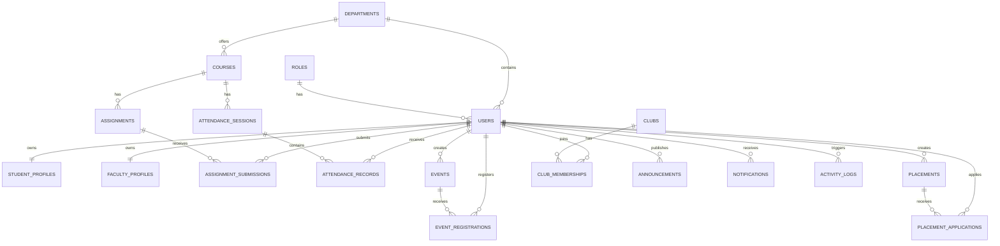

# Architecture And Diagrams

Smart Campus Manager is implemented as a React + TypeScript single-page app for the current MVP. The UI is backed by typed seeded data in `src/data/campusData.ts`, which mirrors the planned database entities and API contracts.

Future backend integration can replace the seed data layer with API calls while keeping the role-aware UI modules intact.

## System Diagram

```text
User Browser
    |
    v
React + TypeScript App
    |
    +--> Demo Auth State
    +--> Role-Aware Navigation
    +--> Dashboard Modules
    |       +--> Student Dashboard
    |       +--> Faculty Dashboard
    |       +--> Coordinator Dashboard
    |       +--> Admin Dashboard
    |
    +--> Campus Modules
    |       +--> Attendance
    |       +--> Assignments
    |       +--> Events
    |       +--> Placements
    |       +--> Announcements
    |       +--> Notifications
    |       +--> Users
    |       +--> Analytics
    |
    v
Typed Seed Data Layer
```

## Planned Production Architecture

```text
User Browser
    |
    v
Frontend Web App
    |
    v
Backend API
    |
    +--> Auth Service
    +--> Role Permission Middleware
    +--> Campus Modules
    +--> File Upload Service
    |
    v
Database
    |
    v
Activity Logs
```

## ER Diagram Source



See `ps1_database_schema.md` for the detailed field-level schema.
